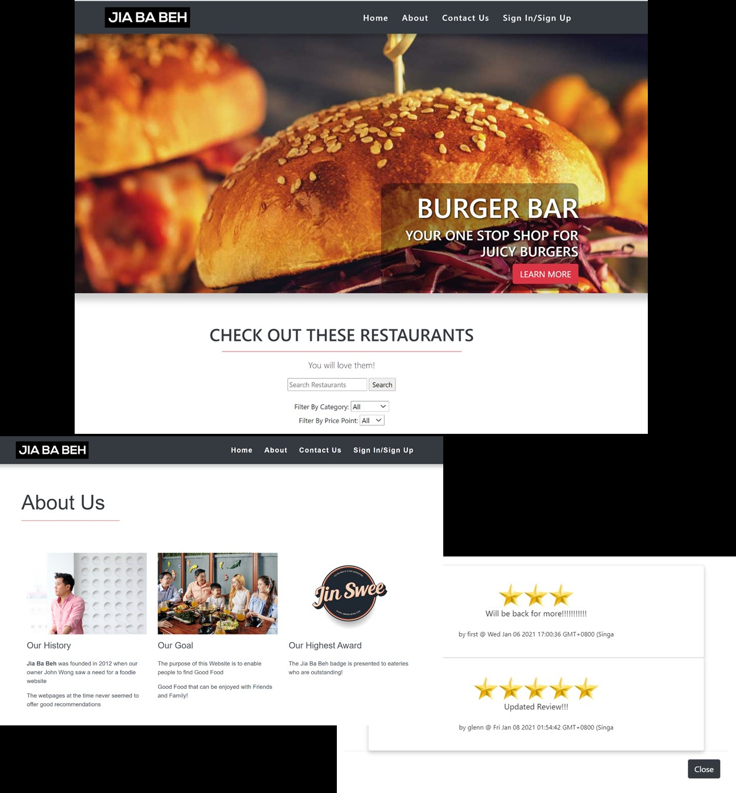
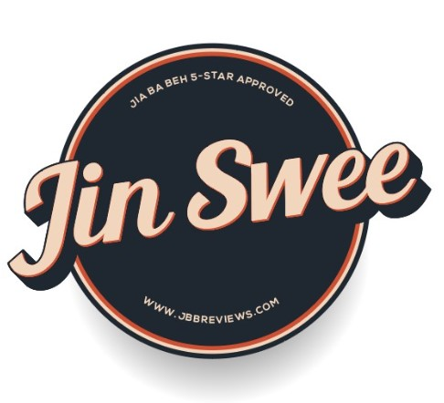
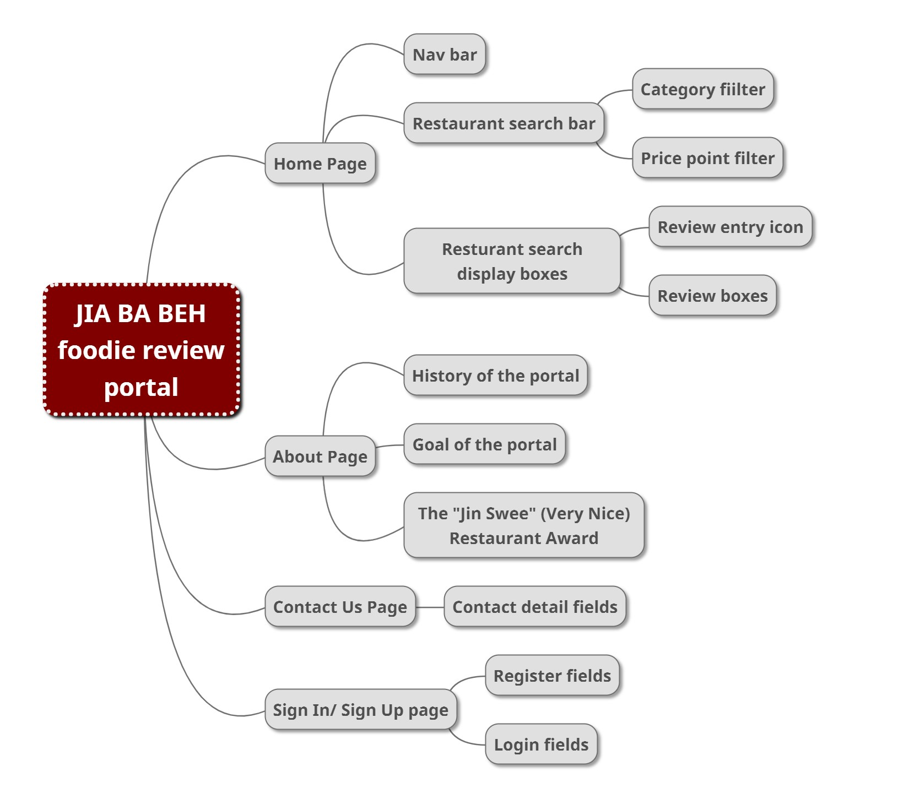
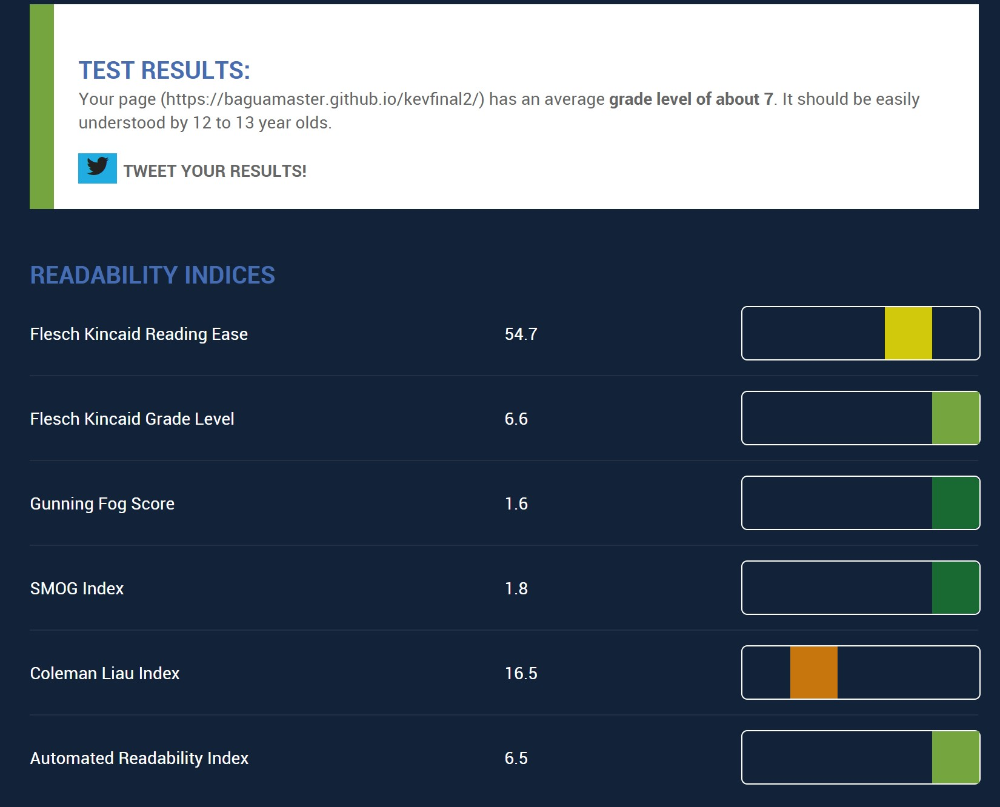
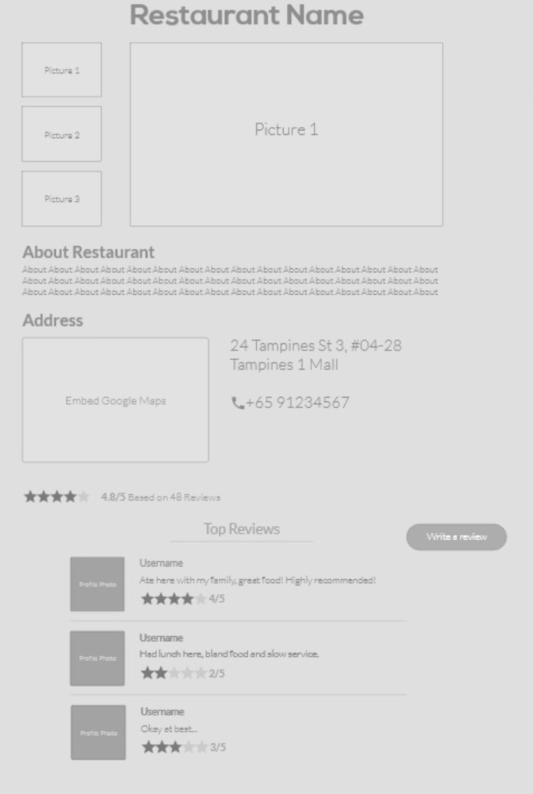
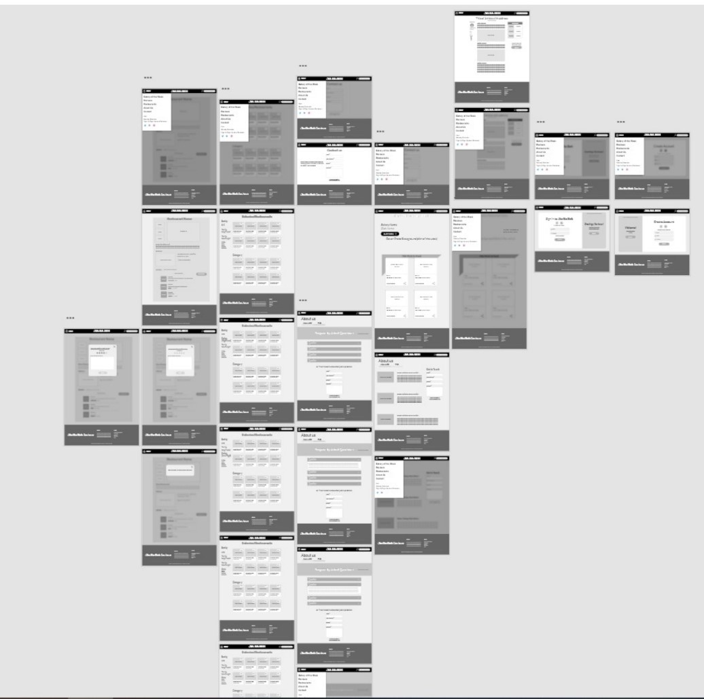
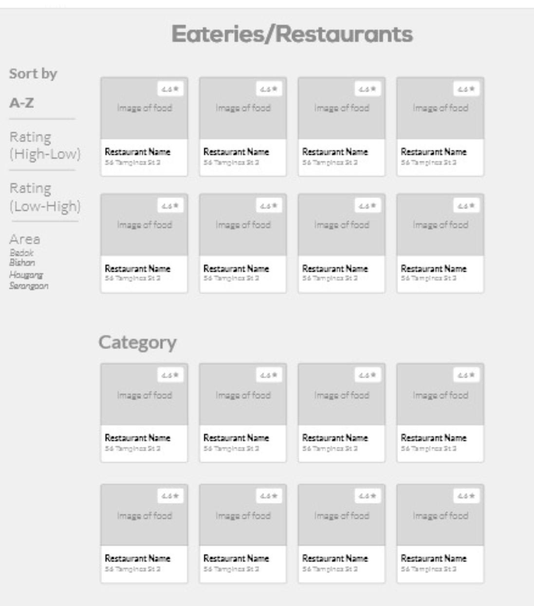
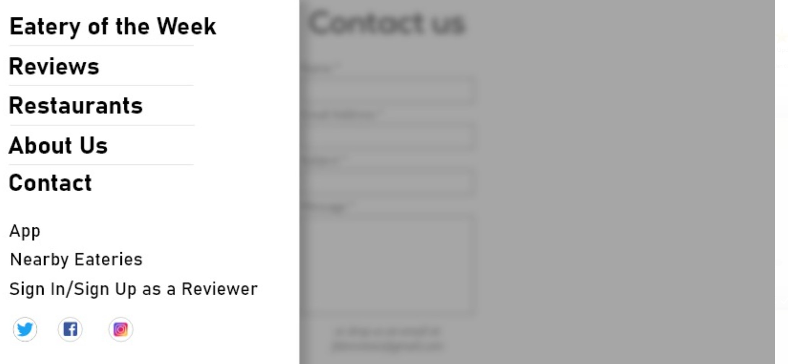
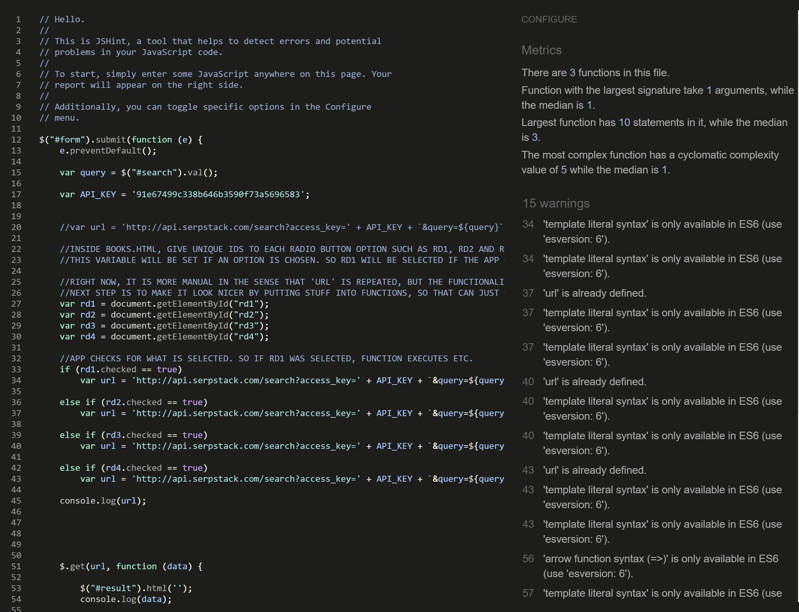

# **Website for**

# **JIA BA BEH**

**Milestone Project 3**

**Python and Data-Centric Development**

By Kevin Ho | [traderkev54@yahoo.com](mailto:traderkev54@yahoo.com)

&quot;
# **JIA BA BEH&quot;**

[_Singaporean Hokkien Dialect_: &quot;Have you eaten?&quot;]

**Context**

This project involves writing custom Python Flask, HTML, CSS, Javascript with MongoDB for a food review website called &quot;JIA BA BEH&quot; (Have you eaten?). Basic requirements to meet will be in the form of CRUD database functions for membership creation and review posts.

The client, an up and coming Foodie Blogger called John Wong, wants a simple to use website to allow his followers to post reports of new food places and reviews their dishes.

- Encourage interactivity by encouraging visitors to post short reviews / feedback on the various food vendors in the website.
- A member registration process will be necessary to post reviews
- Reviewers will be allowed to update or make edits to their reviews once posted
- To showcase the range of food Singapore has to offer

External user&#39;s goal: To access crowd-sourced feedback on food outlets in Singapore

Site owner&#39;s goal: To showcase the range of food Singapore has to offer, and allow his followers to post their foodie experiences on the website

**Demo Version of the Website**

Deployment of the website can be found in the heroku URL:

[**https://kh-kevfoodieproj3.herokuapp.com/**](https://kh-kevfoodieproj3.herokuapp.com/)

Github version control maybe accessed via:

[**https://github.com/baguamaster/kevfoodieproj3**](https://github.com/baguamaster/kevfoodieproj3)

# **Website Purpose**

The purpose of this website is to allow crowd-sourced reviews of foodie places in Singapore to be posted on the website, and to become a portal for all things foodie.

# **Strategic Considerations**

**Identifying External Users**

The website is designed to attract visitors to play with the review fields by posting feedback on foodie places they have visited.

1. Foodies who want to share their new discovery with the community
2. Those who want to post reviews and feedback on the various outlets
3. Those wishing to have an online place they can go for foodie suggestions
4. Followers of Foodie Blogger John Wong in his quest to unveil new places to eat in Singapore

**Identifying External Users&#39; Goals**

Those using this website are likely to need it as:

1. A directory of foodie places to go, of sorts
2. A repository of past experiences/feedback
3. A place to share reviews and find new experiences to go to

**Identifying Site Owner&#39;s Goals**

The site owner, up-and-coming Foodie Blogger, John Wong, wants this website to:

1. Promote awareness of his curated list of goof foodie places to go to
2. Raise the profile of his personal foodie Branding
3. Encourage visitors to have a go at writing reviews
4. Become a portal where other foodies go to
5. To introduce the &quot;JIN SWEE&quot; (Very Nice) foodie award – similar in spirit to the Michelin Star award

# **Scope**

**Functional Requirements**

**Mandatory**

**LO1**  **Design, develop and implement a back-end for a full-stack web application using Python and a micro-framework**

- Follows the principles of UX design, meets its given purpose and provides a set of user interactions
- Implement custom HTML and CSS code to create a responsive full-stack application consisting of one or more HTML pages with relevant responses to user actions and a set of data manipulation functions
- Build a non-relational database-backed Flask web application that allows users to store and manipulate data records about a particular domain.
- Design a database structure that is relevant for your domain, consisting of a minimum of one collection.
- Design and implement manual test procedures to assess functionality, usability, responsiveness and data management within the Full Stack web application
- Write Python code that is consistent in style and conforms to the PEP8 style guide (or another explicitly mentioned style guide, such as Google&#39;s) and validated HTML and CSS code.
- Include sufficient custom Python logic to to demonstrate your proficiency in the language
- Include functions with compound statements such as if conditions and/or loops in your Python code
- Write code that meets minimum standards for readability (comments, indentation, consistent and meaningful naming conventions).
- Name files consistently and descriptively, without spaces or capitalisation to allow for cross-platform compatibility.

 

**UX Site Structure Development &amp; Information Organisation (corresponding to above L01)**

**Information Architecture**

**Content Inventory**

Information required on the website to fulfil the content requirements.

1. Explanation of what JIA BA BEH is about
2. Services that JIA BA BEH specializes in
3. A review posting facility allowing fans of the foodie blogger to post reviews
4. A free member registration process
5. Imagery appropriate to the website
6. Ability to post new restaurants for review and feedback
7. Introduction of the &quot;JIN SWEE&quot; (Chinese dialect for &quot;Very Nice&quot;) Award for the best restaurants and eating establishments (aka a local Michelin star award)
8. Contact details / sign up page
9. To at all times expound JIA BA BEH lifestyle proposition

**Key Classes of Images required**

1. Food images
2. Logo of restaurants and eating establishments
3. Star review icons

**Content Structure (Sitemap)**

The website will be arranged in a simple order:

Home Page \&gt; About \&gt; Contact \&gt;Sign Up for more Powerful Tools

**Each page has its own hyperlinks relevant to it**

1. **Home Page:**
  - It opens with a &quot;bang&quot; and has a carousel feature showing large images of food
    1. Catches attention via big colourful visuals
    2. The nav bar at the top allows easy access to the other sections of the website.
    3. Further down the carousel is the restaurant search engine which also displays results as multiple-section boxes
    4. Each restaurant box also carries a clickable icon to pass review of the establishment
    5. Every single page in the website has a jumbotron with a link to the &quot;Contact Us&quot; button. – This is the call to action.
    6. There are links to social media at the bottom of the page as well

1. **About:**

  - Explains the nature of the website
  - How its owner, foodie blogger, John Wong&#39;s intention to bring food lovers together via the site
  - Explain how food reviews are crowd sourced
  - Introduces the food award called the &quot;JIN SWEE&quot; (Chinese dialect for &quot;Very Nice&quot;) – similar to the Michelin Star

**Website Interactivity**

1. Usability
  1. Website navigation controls are kept simple to be familiar to a web surfer, and a same consistency in design elements permeates throughout the website.
    1. Logo that leads back to the home page
    2. Main navigation bar at the top
    3. Pagination is included to help visitors identify which part of the site they are at
    4. Easy to identify buttons
2. Reader Comprehension
  1. Content are grouped according to subject matter and prose is broken up when long.
  2. The Flesch Readability Test = 54.7, Flesch-Kincaid Grade Level Score = 7, which means the website is easily understood by 13-14 year olds and up.

 

1. Operability
  1. The visitor should be able to easily navigate without trouble.
  2. There is a form function in the &quot;subscribe&quot; page to allow communication
  3. There is sufficient information for an interested party to communicate.
  4. Both search engines follow the familiar search bar and radio buttons format
2. Attractiveness
  1. A responsive design takes into consideration how it looks when on viewed on a desktop browsers as well as smaller screens like mobile phone. The layout will change to cater for different size of the device
  2. Utilisation of white spaces between different sections and components of the page to increase readability
3. Usability compliance
  1. Semantic HTML to enhance code readability
  2. Optimisation of website elements
  3. Compliance to website accessibility guidelines
  4. SEO optimization will be for subsequent steps

# **Page Structure and Interactions**

**Interface Design**

- Each page will include 4 parts - header, main, jumbotron call to action and footer.
- Header, Call to action and footer include sections that will be repeated all the pages to improve predictability and consistency.
- Header will include a logo and the main navbars
- The jumbotron containing the call to action button will link to the &quot;Contact Us&quot; page
- Footer will include a links to social media
- The main content section will display content related to the relevant subject matter

**Site Map**

 

**Navigation Elements**

Responsiveness and utility courtesy of Bootstrap…

**Logo**

The logo found on either the navbar links or the footer to Home page [Bootstrap Component - Navbar]

**Main Navigation**

Main Navigation is a fixed position menu at the top of every web page. The navbar links are listed clearly and they are hyperlinked to their respective pages. [Bootstrap Component - Navbar]

**Collapsible Hamburger Mobile Menu**

The top navigation will be minimised into a hamburger menu when displayed in mobile screens or other small screens. Clicking on it will display the familiar 4 choices. [Bootstrap Component - Navbar]

**Call-to-action Jumbotron**

This section features on every page and has a button offering a free trial, which is hyperlinked to the Contact Us page.

**Footer**

The footer contains the logo, and disclaimers

# **UX**

**Colour**

An maroon, black white theme is used in this instance.

**Fonts**

Monserrat font is used throughout for the website as it is clean, not too common and has nice kerning spaces.

**Images**

Images are chosen for their powerful storytelling ability and whilst some real pictures are used, some stock images were utilized in this demo version. No doubt in the production version, some professional images will need to be shot again.

**Copy**

Copy is written in an easy-going style, and aims to educate the reader on the many aspects of information security.

**Responsiveness**

The site is meant to be responsive to many devices, from desktop and laptop screen to tablets and smart mobile phones. It can be viewed in both portrait and landscape orientation. The breakpoints are usually half of the visual range in this instance.

**Consistency of design and messaging**

All elements on the website are intentioned to carry the same look and feel. The colour scheme and design schema using curved boxes/buttons carry this through. The call to action is ever-present in every page.

**Contact Form**

The contact form in the Contact Us page is meant to facilitate either email, voice, or drop-in communications. It is deliberately kept simple.

**LO2**  **Demonstrate competence in modeling and managing non-relational data effectively**

- Design a data model that fits the purpose of the project
- Develop the model into a usable non-relational database where data is stored in a consistent and well-organised manner.

 

**Database schema**

The non-relational database uses MongoDB and focuses on the management of straightforward data such as restaurant name, address, feedback star, restaurant introduction, peer review.

 

**LO3 Demonstrate competence in querying and manipulating non-relational data effectively**

- Create functionality for users to create, locate, display, edit and delete recordsInsert screenshots of the finished project that align to relevant user stories

**Displaying of search results**

A simple 4 column design is used to display search results by category and by price point:

 

 

- Additional search tags are appended to the original user-defined input to aid in specific searches for documents etc

**LO4 Deploy a full stack web application to a cloud platform**

- Deploy a final version of the full-stack application code to a cloud-based hosting platform (e.g. Heroku) and test to ensure it matches the development version
- Ensure that final deployed code is free of commented out code and has no broken internal links
- Document the deployment process in a README file in English that also explains the application&#39;s purpose and the value that it provides to its users

**LO5 Identify and apply security features**

- Use Git &amp; GitHub for version control of a Full Stack web application up to deployment, using commit messages to document the development process.
- Commit final code that is free of any passwords or security sensitive information, to the repository and to the hosting platform
- Use environment variables, or files that are in .gitignore, to hide all secret keys
- Ensure that DEBUG mode is turned off in production versions

# **Testing Phase**

All aspects of the website are tested with each series of github commits.

Testing procedure usually follows this format:

- Code is written and eyeballed on the Chrome browser for subtleties in changes
- Amendments are made and visually crosschecked
- Errors are caught early when functions or UX elements are seen to be out of place or do not work
- In cases where functions do not work as intended (or do not work at all), internet resources are consulted to check consistency of approach with current practices
- In some cases where bugs are not found easily, the individual component is cloned to another visual studio code window (UAT environment) and operated upon till a solution is found
- This method prevents accidental and unintended changes to the parent file
- Improvements that are successful are then copied back to the original parent file
- Thus the steps are:
  - WRITE CODE \&gt; ERROR DETECTED \&gt; BUG FIX PROCESS \&gt; ISOLATE CODE IF NEEDED \&gt; RESOLVE ON SEPARATE INSTANCE OF CODE \&gt; SOLUTION FOUND \&gt; RE-INTEGRATE BACK TO ORIGINAL PARENT FILE

Post deployment test procedures:

- Comparisons made between development and production versions are monitored
- Differences are reconciled by a detailed line-by-line debugging
- Better methods are deployed if the code is proven to be more efficient

**Sample of Detailed Testing Steps**

**Form Check**

**Validating Markup**

- JS scripts have cleared Jshint Linter
- What remains are largely esversion:6 syntax issues.

 

- 3 pages checked using W3C Jigsaw CSS Validator (https://jigsaw.w3.org/css-validator/)
  - home.html – 2 errors detected in bootstrap.css.min (told to ignore them by instructor)
  - cerberus.html – Same 2 errors
  - about.html – Same 2 errors

- 3 pages validated using W3 Markup Validation Service ([http://validator.w3.org/](http://validator.w3.org/))
  - home.html - Document checking completed. No errors or warnings to show.
  - contact.html - Document checking completed. No errors or warnings to show.
  - about.html - Document checking completed. No errors or warnings to show.

- 3 pages checked using W3C Link Checker ([https://validator.w3.org/checklink](https://validator.w3.org/checklink))
  - index.html – none
  - liberatus.html – none
  - contact.html – none

**Navigation Check**

- Was done on each link to determine issues. Any found were rectified.
- 10 persons were invited to check the website for consistencies

**LO4 Deploy an interactive front-end web application to a Cloud platform**

- Deploy a final version of the interactive web application code to a cloud-based hosting platform (e.g. GitHub Pages)
- Ensure that the deployed application is free of commented out code and has no broken internal links
- Use Git &amp; GitHub for version control of an interactive web application up to deployment

**LO5 Demonstrate and document the development process through version control system such as GitHub**

- Document the full development cycle, with clear evidence given through commit messages, the README.
- Write a README.md file in English for the interactive web application that explains its purpose and the value that it provides to its users.
- Clearly separate and identify code written for the interactive web application and code from external sources (e.g. libraries or tutorials). Attribute any code from external sources to its source via comments above the code and (for larger dependencies) in the README.
- Use consistent and effective markdown formatting, that is well-structured, easy to follow, and has few grammatical errors, when writing a README file.

**Deployment**

- The code is updated as a github repository and committed to on a regular basis
- Currently there have been commits in the development phase
- Deployment to the web is made via Heroku

**Quality Assurance**

- The code is scraped to clean itself of commented out code and does not have broken links
- Version control was initially done on an independent instance in Visual Code Studio and eventually ported over to Gitpod and Heroku by way of Github for deployment

# **Technologies Applied**

- **HTM5**  to structure the webpages and  **CSS3**  to style them.
- **JavaScript to run functions**
- **Python 3.7 via the Flask framework to drive database functions**
- **MongoDB for non relational noSQL data management**
- **Git**  \* for Versioning Control System and  **GitHub**  for repositories.
- **Bo**** otstrap 4.5 ****, including its components and utilities for layout. Key elements favoured:**
  - NavBar is used for the main navigation,
  - Distinct images are used as attention grabber
  - Jumbotron is used for carrying the call to action button
  - CSS Stylesheet from w3newbie (https://w3newbie.com/responsive-html5-web-design-tutorial-and-free-template-code/)
  - Code Institute&#39;s templates ([https://github.com/Code-Institute-Org/gitpod-full-template](https://github.com/Code-Institute-Org/gitpod-full-template)) to start the coding.
  - The template used for Readme.md is also from Code Institute ([https://github.com/Code-Institute-Solutions/readme-template/blob/master/README.md](https://github.com/Code-Institute-Solutions/readme-template/blob/master/README.md))

- **Other Tools are also used in the course of development:**
  - For validating JavaScript:
    - JShint validator ([https://jshint.com/](https://jshint.com/))
  - For validating markup:
    - W3 Markup Validator ([http://validator.w3.org/](http://validator.w3.org/))
  - For validating CSS:
    - W3 Jigsaw Validator (https://jigsaw.w3.org/css-validator/)
  - For checking links:
    - W3C Link Checker ([https://validator.w3.org/checklink](https://validator.w3.org/checklink))
  - For image editing
    - Adobe Lightroom ([https://lightroom.adobe.com/](https://lightroom.adobe.com/))
  - For responsiveness:
    - Responsive Web Design Checker ([https://responsivedesignchecker.com/](https://responsivedesignchecker.com/))
  - For mindmapping:
    - Mindup mind mapper ([https://www.mindmup.com/](https://www.mindmup.com/))
  - For UX readability:
    - Flesch-Kincaid readability test ([https://www.webfx.com/tools/read-able/](https://www.webfx.com/tools/read-able/))
  - For UX viewing on various device formats:
    - Responsinator: ([https://www.responsinator.com/](https://www.responsinator.com/))

# **Deployment**

**Preparation**

All major changes were committed on Visual Code Studio as an independent instance and ported over to gitpod and Heroku via github towards deadline.

**Content**

- Ensured all the last changes were saved and committed.
- Committed final Heroku Push
- Committed a final Git Push
- Latest deployment enabled

**Git Version Control Pages**

[**https://github.com/baguamaster/kevfoodieproj3**](https://github.com/baguamaster/kevfoodieproj3)

**Demo Website (Deployed via Heroku)**

[**https://kh-kevfoodieproj3.herokuapp.com**](https://kh-kevfoodieproj3.herokuapp.com/)
